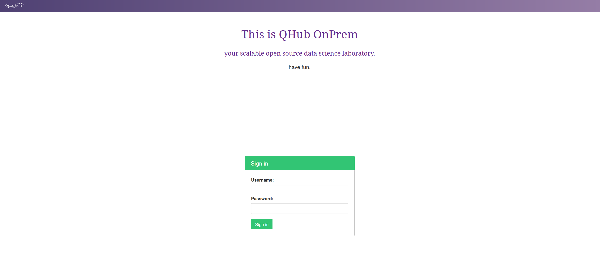
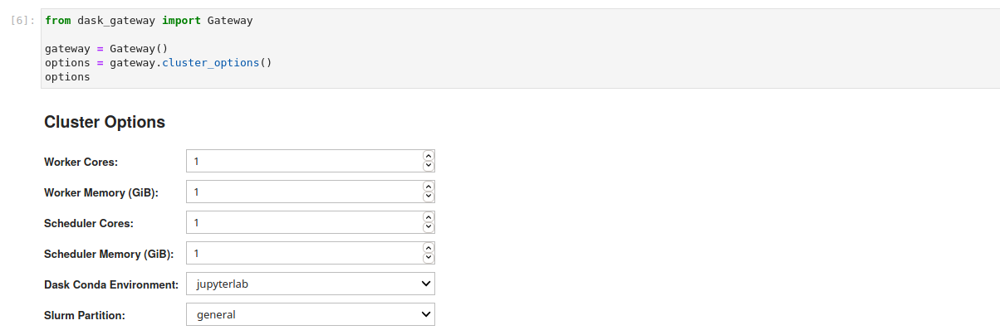

**EXPERIMENTAL** Note that QHub HPC is currently experimental

# QHub HPC

QHub HPC is an opinionated open source deployment of
[jupyterhub](https://jupyterhub.readthedocs.io/en/stable/) based on an
HPC jobscheduler. QHub HPC is a "distribution" of these packages
much like [Debian](https://www.debian.org/) and
[Ubuntu](https://ubuntu.com/) are distributions of
[Linux](https://en.wikipedia.org/wiki/Linux). The high level goal of
this distribution is to form a cohesive set of tools that enable:
 - environment management via [conda](https://docs.conda.io/en/latest/) and [conda-store](https://github.com/Quansight/conda-store)
 - monitoring of compute infrastructure and services
 - scalable and efficient compute via
   [jupyterlab](https://jupyterlab.readthedocs.io/en/stable/) and
   [dask](https://dask.org/)
 - deployment of jupyterhub on prem without requiring deep devops
   knowledge of the Slurm/HPC and jupyter ecosystem

# Features

 - Scalable compute environment based on the
   [Slurm](https://slurm.schedmd.com/overview.html) workload manger to
   take advantage of entire fleet of nodes
 - Ansible based provisioning on Ubuntu 18.04 and Ubuntu 20.04 nodes
   to deploy one master server and `N` workers. These workers can be
   pre-existing nodes in your compute environment
 - Customizable Themes for JupyterHub
 


 - JupyterHub integration allowing users to select the memory, cpus,
   and environment that jupyterlab instances for users are launched in


 - Dask Gateway integration allowing users to selct the memory, cpus,
   and environment that dask schedule/workers use
   

   
 - Monitoring of entire cluster via [grafana](https://grafana.com/) to
   monitor the nodes, jupyterhub, slurm, and traefik
   

   
 - Shared directories between all users for collaborative compute

# Dependencies

 - [ansible](https://docs.ansible.com/ansible/latest/installation_guide/intro_installation.html)
 - [vagrant](https://www.vagrantup.com/docs/installation) for testing

Install ansible dependencies

```shell
ansible-galaxy collection install -r requirements.yaml
```

# Testing

There are tests for deploying QHub HPC on a virtual machine
provisioner and in the cloud.

## Virtual Machines

Vagrant is a tool responsible for creating and provisioning vms. It
has convenient integration with ansible which allows for easy
effective control over configuration. Currently the `Vagrantfile` only
has support for `libvirt` and `virtualbox`.

```shell
cd tests/ubuntu1804
# cd tests/ubuntu2004
vagrant up --provider=<provider-name>
# vagrant up --provider=libvirt
# vagrant up --provider=virtualbox
```

Notebook for testing functionality
 - `tests/assets/notebook/test-dask-gateway.ipynb`

## Cloud

 - [Digital Ocean Test Deployment](./tests/digitalocean/README.md)

# Services

Current testing environment spins up four nodes:
 - all nodes :: node_exporter for node metrics
 - master node :: slurm scheduler, munge, mysql, jupyterhub, grafana, prometheus
 - worker node :: slurm daemon, munge
 
## Jupyterhub

Jupyterhub is accessible via `<master node ip>:8000`

You may need to find a way to port-forward, e.g. over ssh:

```
vagrant ssh hpc01-test -- -N -L localhost:8000:localhost:8000
```

then access http://localhost:8000/ on the host.

## Grafana

Grafana is accessible via `<master node ip>:3000`

# License

[QHub HPC is BSD3 licensed](LICENSE).


# Contributing

Contributions are welcome!
